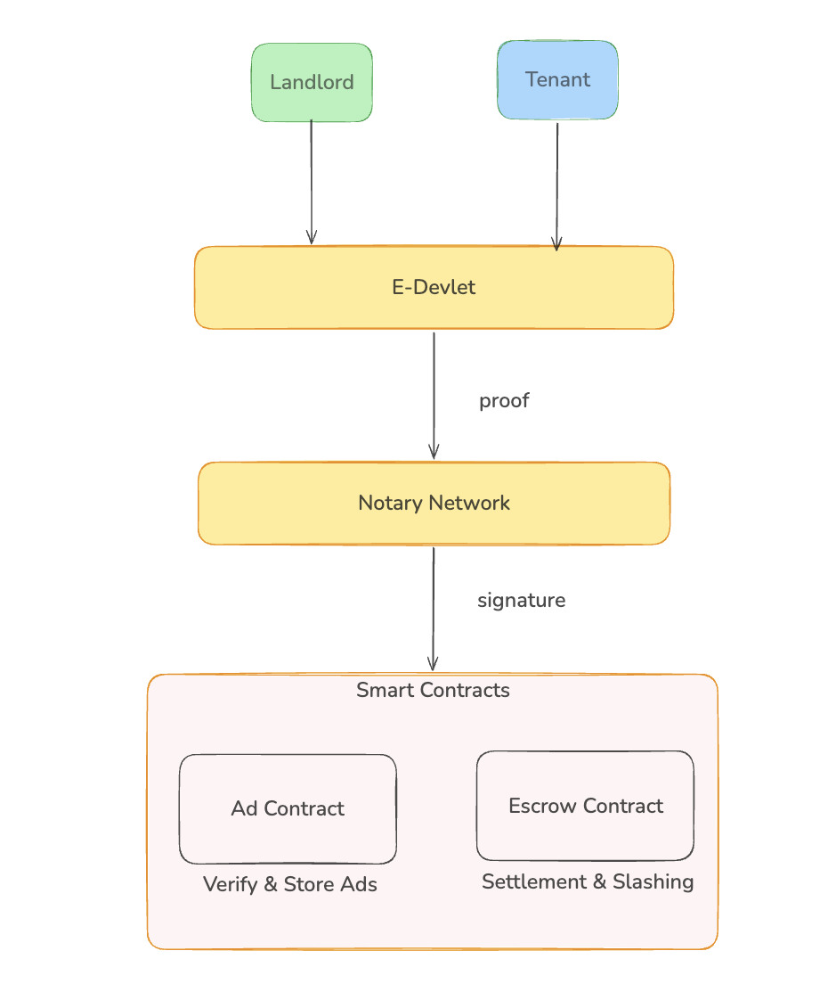
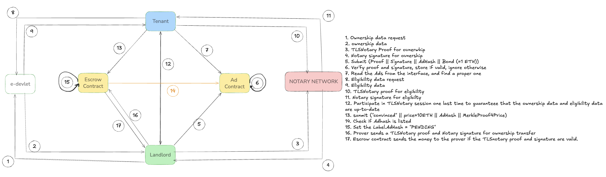

# PPREV Protocol

**Privacy-Preserving Real Estate Verification on Ethereum**

[](https://github.com/y4hyya/pprev-protocol-implementation/actions)
[](https://soliditylang.org/)
[](LICENSE)

PPREV enables landlords and tenants to prove property ownership and income eligibility on-chain **without exposing personal data**. Only predicate results (`owns_property = true`, `income >= threshold`) are recorded on-chain. PII, registry extracts, and income figures stay off-chain.

> **Research Paper**: *PPREV: Privacy-Preserving Real Estate Verification* — a protocol for predicate-only proofs from authority-served records via TLSNotary and zero-knowledge circuits, with crypto-economic deterrence (collateral, slashing) for post-verification behavior. Built on the Turkish E-Devlet (e-Government) identity and property registry system.

---

## Table of Contents

- [Overview](#overview)
- [Architecture](#architecture)
- [Protocol Flow](#protocol-flow)
- [State Machine](#state-machine)
- [Tech Stack](#tech-stack)
- [Project Structure](#project-structure)
- [Getting Started](#getting-started)
- [Testing](#testing)
- [Smart Contract API](#smart-contract-api)
- [Notary Server API](#notary-server-api)
- [Security Features](#security-features)
- [Configuration](#configuration)
- [Known Limitations](#known-limitations)
- [License](#license)

---

## Overview

Real estate transactions require proving conditions (ownership, income eligibility, lien status) without exposing sensitive registry data. Existing workflows rely on broad document sharing or trusted intermediaries.

PPREV solves this with a 4-step workflow:

1. **Retrieve** — Party fetches records from an authoritative HTTPS source (E-Devlet)
2. **Attest** — Notary Network verifies the data and signs an ECDSA attestation
3. **Prove** — Only predicate results are committed on-chain (no PII)
4. **Settle** — Smart contract verifies signature, enforces escrow, and handles settlement/slashing

```
+------------------------------------------------------------------+
|                        What Goes On-Chain                        |
+------------------------------------------------------------------+
| adHash, policyId, C_T (commitment), nonce, ECDSA signature       |
| Listing status, escrow amounts, collateral                       |
+------------------------------------------------------------------+
|                      What Stays Off-Chain                        |
+------------------------------------------------------------------+
| Name, TC Kimlik No, income figures, property registry extracts   |
| Employment records, credit scores, personal addresses            |
+------------------------------------------------------------------+
```

---

## Architecture



```
+-----------+          +-----------+
| Landlord  |          |  Tenant   |
+-----+-----+          +-----+-----+
      |                      |
      |   identity + proof   |
      +----------+-----------+
                 |
         +-------v--------+
         |    E-Devlet     |
         | (e-Government)  |
         +-------+---------+
                 |
                 | ownership / income records
                 |
         +-------v---------+
         | Notary Network  |
         | (ECDSA signer)  |
         +-------+---------+
                 |
                 | signature (sigma)
                 |
      +----------v-----------+
      |    Smart Contracts    |
      |  +--------+--------+ |
      |  |   Ad   | Escrow | |
      |  |Contract|Contract| |
      |  +--------+--------+ |
      |  Verify & Store Ads  |
      |  Settlement & Slash  |
      +-----------------------+
```

**Components:**

| Component | Description | Location |
|-----------|-------------|----------|
| PPREVSingle | Solidity smart contract (Ad + Escrow combined in MVP) | `src/PPREVSingle.sol` |
| ECDSANotaryVerifier | On-chain ECDSA signature verification via `ecrecover` | `src/PPREVSingle.sol` |
| Notary Server | Express.js server simulating the Notary Network | `backend/notary-server.js` |
| E-Devlet Mock | Mock Turkish e-Government identity database | `backend/edevlet-mock.json` |
| Frontend | Single-page application with MetaMask integration | `frontend/index.html` |

---

## Protocol Flow



### Listing Registration (Landlord)

| Step | Action | From | To |
|------|--------|------|-----|
| 1 | Ownership data request | Landlord | E-Devlet |
| 2 | Ownership data response | E-Devlet | Landlord |
| 3 | TLSNotary proof for ownership | Landlord | Notary Network |
| 4 | Notary ECDSA signature for ownership | Notary Network | Landlord |
| 5 | `registerListing(proof, sigma, adHash, bond, policyId)` | Landlord | Ad Contract |
| 6 | Store listing and lock collateral bond | Ad Contract | (on-chain) |

### Application (Tenant)

| Step | Action | From | To |
|------|--------|------|-----|
| 7 | Browse listings, find a suitable property | Tenant | Ad Contract |
| 8 | TLSNotary proof for eligibility (income, credit) | Tenant | Notary Network |
| 9 | Notary verifies: `income >= threshold` | Notary Network | (internal) |
| 10 | Predicate result: "Eligibility passed" | Notary Network | Tenant |
| 11 | `applyToListing(sigma_elig, C_T, adHash, deposit)` | Tenant | Escrow Contract |
| 12 | Verify proof + signature, lock escrow deposit | Escrow Contract | (on-chain) |

### Settlement

| Step | Action | From | To |
|------|--------|------|-----|
| 13 | Physical key handover (off-chain) | Landlord | Tenant |
| 14 | Get application status = PENDING_TRANSFER | Landlord | Escrow Contract |
| 15 | Request settlement attestation from Notary | Landlord | Notary Network |
| 16 | `settleListing(appId, sigma_settle)` | Landlord | Escrow Contract |
| 17 | Release escrow + collateral to landlord | Escrow Contract | Landlord |

### Expiration (Slashing)

| Step | Action | From | To |
|------|--------|------|-----|
| 18 | Deadline passes without settlement | (timeout) | - |
| 19 | `expireApplication(appId)` — anyone can call | Anyone | Escrow Contract |
| - | Escrow returned to tenant + 10% collateral slash | Escrow Contract | Tenant |
| - | Listing returns to ACTIVE (or auto-cancels after 5 expirations) | Escrow Contract | (on-chain) |

---

## State Machine

### Listing States

```
                    registerListing()
                          |
                          v
+------+  register   +--------+  applyToListing()  +--------+
| NONE | ----------> | ACTIVE | ------------------> | LOCKED |
+------+             +--------+                     +--------+
                       ^    |                         |     |
                       |    | cancelListing()         |     | settleListing()
           expire      |    v                         |     v
         (< max)       | +-----------+                | +---------+
           +------------ | CANCELLED | <--------------+ | SETTLED |
                         +-----------+   expire(>=max)  +---------+
```

### Application States

```
+------+  applyToListing()  +------------------+  settleListing()  +---------+
| NONE | -----------------> | PENDING_TRANSFER | -----------------> | SETTLED |
+------+                    +------------------+                    +---------+
                                    |
                                    | expireApplication()
                                    v
                               +---------+
                               | EXPIRED |
                               +---------+
```

### State Transition Table

| Current State | Action | New State | Funds |
|--------------|--------|-----------|-------|
| Listing: NONE | `registerListing()` | ACTIVE | Collateral locked |
| Listing: ACTIVE | `applyToListing()` | LOCKED | + Escrow locked |
| Listing: LOCKED | `settleListing()` | SETTLED | Escrow + collateral -> landlord |
| Listing: LOCKED | `expireApplication()` | ACTIVE | Escrow + 10% slash -> tenant |
| Listing: ACTIVE | `cancelListing()` | CANCELLED | Collateral -> landlord |
| Listing: ACTIVE | expire (>= maxExpirations) | CANCELLED | Remaining collateral -> landlord |
| App: NONE | `applyToListing()` | PENDING_TRANSFER | Escrow locked |
| App: PENDING | `settleListing()` | SETTLED | Escrow transferred |
| App: PENDING | `expireApplication()` | EXPIRED | Escrow returned |

---

## Tech Stack

| Layer | Technology | Version |
|-------|-----------|---------|
| Smart Contract | Solidity | 0.8.24 |
| Contract Framework | Hardhat + Foundry | latest |
| Signature Verification | OpenZeppelin ECDSA | 5.6.1 |
| Reentrancy Protection | OpenZeppelin ReentrancyGuard | 5.6.1 |
| EVM Target | Cancun | - |
| Notary Server | Node.js + Express | 20.x |
| Signing Library | ethers.js | 6.13.0 |
| Frontend | Vanilla JS + ethers.js | 6.13.0 |
| Local Chain | Hardhat Network / Anvil | 31337 |
| Containerization | Docker + Docker Compose | - |
| CI | GitHub Actions (Foundry + Hardhat) | - |

---

## Project Structure

```
pprev-protocol/
|-- src/
|   |-- PPREVSingle.sol          # Main contract + verifiers
|   +-- TestHelpers.sol          # Failing verifier mocks (test-only)
|-- backend/
|   |-- notary-server.js         # Notary Network simulation (Express)
|   +-- edevlet-mock.json        # Mock E-Devlet identity database
|-- frontend/
|   |-- index.html               # Single-page application
|   |-- theme.css                # Design tokens and reset
|   |-- layout.css               # Navigation, hero, responsive
|   |-- components.css           # Buttons, cards, badges, forms
|   +-- components2.css          # Dashboard, terminal, visualizer
|-- scripts/
|   |-- deploy.ts                # Deploy all contracts + whitelist policies
|   +-- simulate.ts              # Full lifecycle simulation (real ECDSA)
|-- test/
|   +-- PPREVSingle.t.sol        # Foundry test suite
|-- test-hardhat/
|   +-- PPREVSingle.test.ts      # Hardhat test suite (39 tests)
|-- assets/
|   |-- Abstract_Flowchart.png   # Architecture diagram
|   +-- protocol_flow.png        # Protocol flow diagram
|-- .github/workflows/
|   +-- test.yml                 # CI: Foundry + Hardhat tests
|-- hardhat.config.ts
|-- foundry.toml
|-- Dockerfile
|-- docker-compose.yml
+-- package.json
```

---

## Getting Started

### Prerequisites

- [Node.js](https://nodejs.org/) >= 20
- [Foundry](https://book.getfoundry.sh/getting-started/installation) (optional, for Foundry tests)
- [Docker](https://docs.docker.com/get-docker/) (optional, for containerized simulation)
- [MetaMask](https://metamask.io/) (for frontend interaction)

### Installation

```bash
git clone https://github.com/y4hyya/pprev-protocol-implementation.git
cd pprev-protocol-implementation

# Install dependencies
npm install

# Initialize git submodules (for Foundry)
git submodule update --init --recursive
```

### Deployment (Local)

**Terminal 1** — Start a local blockchain:
```bash
npx hardhat node
```

**Terminal 2** — Deploy contracts:
```bash
npx hardhat run scripts/deploy.ts --network localhost
```

This will:
- Deploy `MockZKVerifier`, `ECDSANotaryVerifier`, and `PPREVSingle`
- Whitelist 3 policies (`rental-policy-v1`, `OWN_RENT_V1`, `OWN_SALE_V1`)
- Verify deployment via on-chain view calls
- Save addresses to `frontend/deployed-addresses.json`

**Terminal 3** — Start the Notary Server:
```bash
node backend/notary-server.js
```

**Browser** — Open `frontend/index.html` and connect MetaMask (Chain ID: 31337).

### Docker (Simulation Only)

```bash
docker compose up --build
```

Runs the full lifecycle simulation on an ephemeral Hardhat chain inside the container.

---

## Testing

### Hardhat (39 tests)

```bash
npx hardhat test
```

Covers: registration, application, settlement, expiration, slashing, cancellation, max expirations, zero escrow prevention, admin functions, verifier guards, duplicate prevention, and event emissions.

### Foundry

```bash
forge test -vvv
```

Covers: happy path, expiration, nonce replay, insufficient collateral, freshness, non-whitelisted policy, non-owner settlement, cancellation, slashing, max expirations, zero escrow, zero-address verifiers, and settle-after-expiry.

### Full Simulation (Real ECDSA)

```bash
npx hardhat run scripts/simulate.ts
```

Runs the complete protocol lifecycle with **real ECDSA signature verification**:
```
Deploy ECDSANotaryVerifier -> Deploy PPREVSingle -> Whitelist Policy
-> Landlord registers listing (notary signs, ecrecover verifies on-chain)
-> Tenant applies (notary signs, escrow locked)
-> Landlord settles (notary signs, funds released)
```

---

## Smart Contract API

### Core Functions

| Function | Caller | Payable | Description |
|----------|--------|---------|-------------|
| `registerListing(adHash, policyId, reqEscrow, C_T, timestamp, nonce, zkProof, zkInputs, thresholdSig)` | Landlord | Yes (collateral) | Register a new listing. Verifies ZK proof + ECDSA signature + freshness + nonce. Locks collateral. |
| `applyToListing(adHash, policyId, C_T, timestamp, nonce, zkProof, zkInputs, thresholdSig)` | Tenant | Yes (escrow) | Apply to an ACTIVE listing. Verifies proofs. Locks escrow. Listing -> LOCKED. |
| `settleListing(appId, C_T, timestamp, nonce, zkProof, zkInputs, thresholdSig)` | Listing owner | No | Settle a LOCKED listing. Releases escrow + collateral to landlord. |
| `expireApplication(appId)` | Anyone | No | Expire an application after timeout. Returns escrow + 10% slash to tenant. |
| `cancelListing(adHash)` | Listing owner | No | Cancel an ACTIVE listing. Returns collateral to owner. |

### Admin Functions

| Function | Description |
|----------|-------------|
| `setZKVerifier(address)` | Update ZK proof verifier (zero-address guarded) |
| `setThresholdVerifier(address)` | Update signature verifier (zero-address guarded) |
| `setFreshnessWindow(uint256)` | Max age for submitted timestamps (default: 300s) |
| `setExpiryTimeout(uint256)` | Seconds before application becomes expirable (default: 3600s) |
| `setMinCollateral(uint256)` | Minimum collateral for registration (default: 0.1 ETH) |
| `setMaxExpirations(uint256)` | Max expirations before auto-cancel (default: 5) |
| `whitelistPolicy(bytes32, bool)` | Whitelist or remove a policy |

### Events

| Event | Emitted When |
|-------|-------------|
| `ListingRegistered(adHash, owner, policyId, reqEscrow, collateral)` | New listing created |
| `ApplicationCreated(appId, adHash, applicant, escrowAmount)` | New application submitted |
| `ApplicationSettled(appId, adHash, applicant, escrowTransferred, collateralReturned)` | Successful settlement |
| `ApplicationExpired(appId, adHash, applicant, escrowReturned, slashAmount)` | Application expired with slashing |
| `ListingCancelled(adHash, owner, collateralReturned)` | Listing cancelled by owner or auto-cancelled |

### Verification Pipeline

```
Every registerListing / applyToListing / settleListing call verifies:

1. Nonce uniqueness     ->  _consumeNonce(nonce)       -- replay protection
2. Timestamp freshness  ->  _verifyFreshness(ts)       -- max 300s old
3. ZK proof             ->  _verifyZKProof(proof, ins) -- delegates to IZKVerifier
4. ECDSA signature      ->  _verifyThresholdSig(m, s)  -- delegates to ECDSANotaryVerifier
                                |
                                v
                     MessageHashUtils.toEthSignedMessageHash(m)
                                |
                                v
                     ECDSA.recover(ethHash, signature) == notaryAddress
```

---

## Notary Server API

Base URL: `http://localhost:3001`

| Method | Endpoint | Description |
|--------|----------|-------------|
| GET | `/notary/info` | Notary address, policy list, identity counts |
| GET | `/notary/edevlet/:address` | Lookup E-Devlet identity for an Ethereum address |
| POST | `/notary/edevlet/register` | Register a new identity (landlord or tenant) |
| POST | `/notary/attest-listing` | Sign ownership attestation for listing registration |
| POST | `/notary/attest-application` | Sign eligibility attestation for tenant application |
| POST | `/notary/attest-settlement` | Sign settlement attestation |

### Attestation Message Format

The notary signs `keccak256(abi.encodePacked(...))` with EIP-191 prefix, matching the smart contract's expected format:

| Attestation | Signed Message |
|-------------|---------------|
| Listing | `keccak256(adHash \|\| policyId \|\| C_T \|\| timestamp \|\| nonce)` |
| Application | `keccak256(adHash \|\| policyId \|\| C_T \|\| timestamp \|\| nonce)` |
| Settlement | `keccak256(appId \|\| C_T \|\| timestamp \|\| nonce)` |

---

## Security Features

| Feature | Mechanism |
|---------|-----------|
| Reentrancy protection | OpenZeppelin `ReentrancyGuard` on all state-changing functions |
| Replay protection | Global nonce consumption (`usedNonces` mapping) |
| Freshness enforcement | Timestamps must be within `freshnessWindow` of `block.timestamp` |
| Signature verification | On-chain ECDSA `ecrecover` via `ECDSANotaryVerifier` |
| Collateral slashing | 10% of landlord collateral penalized on expiration |
| Anti-griefing | Max expiration count (default: 5) auto-cancels drained listings |
| Zero escrow prevention | `reqEscrow > 0` enforced at registration |
| Zero-address guards | Verifier setters and constructor reject `address(0)` |
| Checks-Effects-Interactions | All ETH transfers follow the CEI pattern |
| Policy whitelisting | Only admin-approved policies accepted |
| Duplicate application guard | One active application per (listing, applicant) pair |
| Stale field cleanup | Collateral and escrow fields zeroed after transfer |

---

## Configuration

### Default Parameters

| Parameter | Default | Description |
|-----------|---------|-------------|
| `freshnessWindow` | 300 seconds (5 min) | Max age for submitted timestamps |
| `expiryTimeout` | 3600 seconds (1 hour) | Time before application becomes expirable |
| `minCollateral` | 0.1 ETH | Minimum collateral bond for listing |
| `maxExpirations` | 5 | Expirations before listing auto-cancels |
| Slash rate | 10% | Percentage of collateral penalized on expiration |
| Notary port | 3001 | Notary server listen port |
| Chain ID | 31337 | Local Hardhat/Anvil network |

### Hardhat Accounts (Local Development)

| Account | Role | Address |
|---------|------|---------|
| #0 | Admin (deployer) | `0xf39Fd6e51aad88F6F4ce6aB8827279cffFb92266` |
| #1 | Landlord | `0x70997970C51812dc3A010C7d01b50e0d17dc79C8` |
| #2 | Tenant | `0x3C44CdDdB6a900fa2b585dd299e03d12FA4293BC` |
| #9 | Notary | `0xa0Ee7A142d267C1f36714E4a8F75612F20a79720` |

---

## Known Limitations

This is an MVP implementation. The following are documented scope limitations:

| Area | Limitation | Production Path |
|------|-----------|-----------------|
| ZK Proofs | Mock verifier (always passes) | Replace with Groth16/PLONK verifier contracts |
| TLSNotary | Simulated via ECDSA signatures | Integrate real TLSNotary MPC-TLS sessions |
| Single Applicant | Listing locks on first application | Implement application queue or multi-applicant handling |
| Escrow Model | Simple ETH push transfers | Pull-over-push pattern, ERC-20 support |
| Access Control | Basic `onlyOwner` | OpenZeppelin `AccessControl` with multiple roles |
| Upgradeability | No proxy pattern | UUPS or Transparent Proxy for upgrades |
| Policy Logic | Policies are whitelisted IDs only | On-chain policy predicate evaluation |
| EIP-712 | Raw `keccak256(abi.encodePacked)` | EIP-712 typed structured data for domain separation |
| Ownership Transfer | No transfer mechanism | OpenZeppelin `Ownable2Step` |

---

## License

This project is licensed under the MIT License. See [LICENSE](LICENSE) for details.
